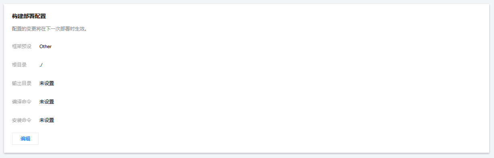

# 一个展示页面

访问：https://iiistudio.github.io/IIIStudio/

## 使用方式

修改wen.json文件

查看wen.json文件，一目了然。

可以使用 github.io与githubusercontent.com，归类标签为GitHub。

可以使用文件夹，归类标签为文件夹名。放在wen中。

## EdgeOne Pages

https://console.cloud.tencent.com/edgeone/pages

