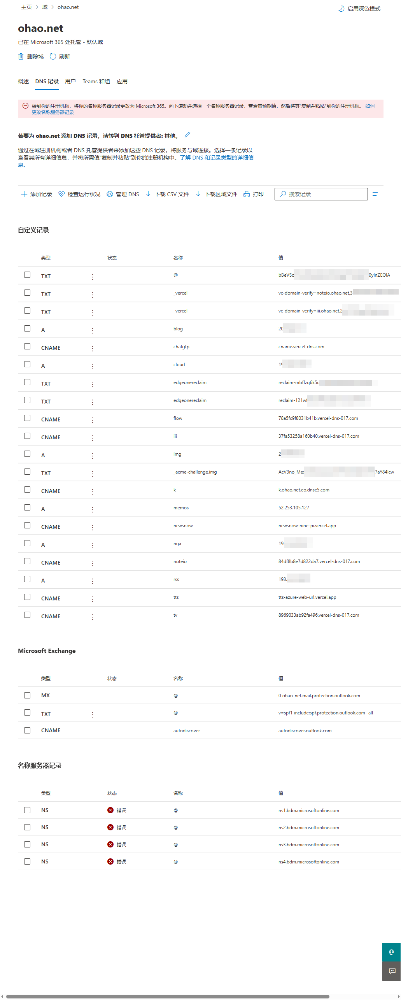
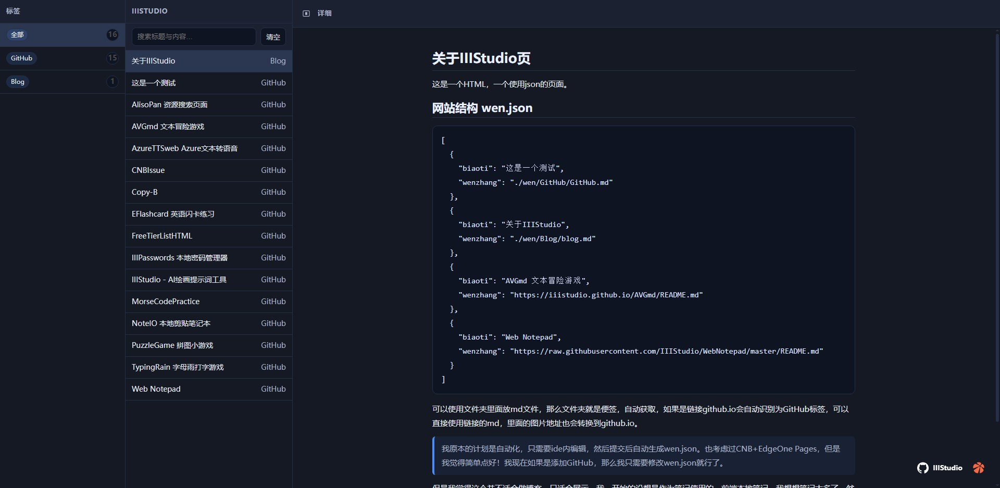

# 我是真的被wordpress这家公司恶心到了。

我想缓一缓，但是还是要说，真他妈恶心。

前几天的时候我发现我网站突然访问不了了，我主要用这个域名放memos，一些我个人的话痨，还有一些GitHub上的东西。


为什么放在wordpress，当时域名在谷歌上面，续期9年之后，可以免费转入wordpress，所以我做了。

[Google Domains托管域名免费转移到WordPress.com可续费1年！- 如有乐享](https://51.ruyo.net/18447.html)


10月1日的时候我还是搞些html让在上面，没想到这就是噩梦的开始。https://github.com/IIIStudio


一共是2个域名，另一个目前能用解析，那个是我很久前用来写博客与微博认证的域名，现在我也不发转出了，也是到2033年的。关于一些隐私我就不是那个域名了，那个是很久都没有用了，主要是一些回忆吧。

我的服务器是用的azure，差不多三年了。下面是我所有的域名解析。



我登录wordpress发现。

违规被封，那个默认的wp网站什么都没有，就是一个空的。

> Your site has been suspended from WordPress.com for violating the Terms of Service. If you believe this was done in error, please contact us as soon as possible to have the suspension reviewed. (To learn more about what is and is not allowed, please see our User Guidelines page.)
> 
> For a limited time, you will still be able to log in to this Dashboard and export your content under Tools → Export. You can self-host your site using the WordPress.org software, though other hosting services may have similar restrictions. If you need help moving, please refer to our guide.


然后我发邮件给wordpress，结果回复的是自动邮箱。

```
Ezra B. (Automattic)

Oct 20, 2025, 14:12 UTC

Hi there,
 
Your domains have been suspended for engaging in phishing and/or technologically harmful content. This is a violation of our Domain Name Registration Agreement and Terms of Service, and as such, your domains will not be restored
 
We reserve the right to limit purchases on WordPress.com sites, so further payments will not be allowed for this account.
Cheers,
Ezra

Payments Operations | Automattic
```
理由域名内容有钓鱼或者有害。


转入的他们不算是付费，不算付费就没有人工，然后我去论坛，发现我无法发论坛，我只能注册小号去发，结果就是他们知道我要干什么之后就把贴子锁了。

https://wordpress.com/forums/topic/hello-my-domain-name-is-not-working/?view=all#post-4090803

当她查到然后贴在就锁了，这也是最后的回复。


现在损失就是丢到了2个域名，还有一些我用域名邮箱注册的网站也可能无法登录了。

我怀疑是https://iiistudio.github.io/IIINavbar/ 这个导致的Vercel：iii-navbar.vercel.app，跳转到iii.ohao.net

结果我问别人，发现也有这样的问题，分析是可能是chatgpt-next-web！！

这东西我搭建了2年多了，都没怎么用过，完全不懂是如何触发的，也没有说明，连通知都没有。

2个域名有一个以前是备案过的，然后因为一些原因（工作吧）我没有搞博客，服务器也没续期，之后备案回访的时候我同意注销了，之后我觉得麻烦就没有去备案，就用海外的服务器，都是我个人使用的。

还好我主要使用的域名邮箱还是在国内了，好吧就这样吧。

# 一个展示页面

访问：https://iiistudio.github.io/IIIStudio/

## 使用方式

修改wen.json文件

查看wen.json文件，一目了然。

可以使用 github.io与githubusercontent.com，归类标签为GitHub。

可以使用文件夹，归类标签为文件夹名。放在wen中。


